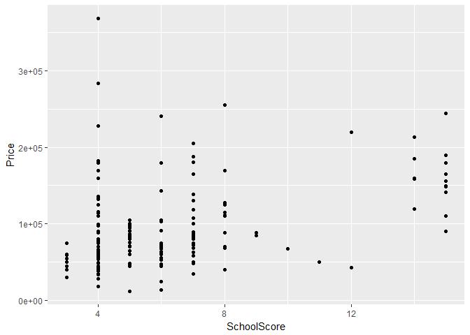

# Lab 03 - Basic Data Operations
Jesse Lecy  


# Variables

Variables are the basic building block of data. When variables are grouped together they are referred to as data sets.

In data analysis we refer to variables as "vectors". The variable is the abstract concept (e.g. price), and the vector is the set of empirical observations in the data set ($108k, $157k, $210k).


# Entering Data

You've collected some data, and now you need to enter it into R. The most basic way to group observations into a single variable is the combine operator: c()

You group variables together into a single data set with the data.frame() operator.


```r
x1 <- c(7,9,1,2)

x1
```

```
## [1] 7 9 1 2
```

```r
x2 <- c("male","male","female","female")

x2
```

```
## [1] "male"   "male"   "female" "female"
```

```r
x3 <- c("treatment","control","treatment","control")

dat <- data.frame( x1, x2, x3, stringsAsFactors=F )

dat
```

<div data-pagedtable="false">
  <script data-pagedtable-source type="application/json">
{"columns":[{"label":["x1"],"name":[1],"type":["dbl"],"align":["right"]},{"label":["x2"],"name":[2],"type":["chr"],"align":["left"]},{"label":["x3"],"name":[3],"type":["chr"],"align":["left"]}],"data":[{"1":"7","2":"male","3":"treatment"},{"1":"9","2":"male","3":"control"},{"1":"1","2":"female","3":"treatment"},{"1":"2","2":"female","3":"control"}],"options":{"columns":{"min":{},"max":[10]},"rows":{"min":[10],"max":[10]},"pages":{}}}
  </script>
</div>

************************


# Types of Variables

Recall that R is smart in that if it knows what type of object it is working with, it can guess as to how it should process the data. You ask a variable, "what are you?", with the class() function.

We have five important classes of data that we will work with this semester.


Class                 | Description
--------------------- | ----------------------------
numeric    | Typical vector of numbers
character  | A vector of letters or words, always enclosed with quotes
factor     | Categories which represent groups, like treatment and control
logical    | A vector of TRUE and FALSE to designate which observations fit a criteria
data frame | Several vectors grouped into a data set
NA         | Used to code missing values


```r
class( x1 )
```

```
## [1] "numeric"
```

```r
class( x2 )
```

```
## [1] "character"
```

```r
class( dat )
```

```
## [1] "data.frame"
```

******************


# Missing Values

Missing values are coded differently in each data analysis program. SPSS uses a period, for example. In R, missing values are coded as "NA".

The important thing to note is that R wants to make sure you know there are missing values if you are conducting analysis. As a result, it will give you the answer of "NA" when you try to do math with a vector that includes a missing value. You have to ask it explicitly to ignore the missing value.


```r
x4 <- c(1,2,3,4)

x4
```

```
## [1] 1 2 3 4
```

```r
sum( x4 )
```

```
## [1] 10
```

```r
mean( x4 )
```

```
## [1] 2.5
```

```r
x4 <- c(1,2,NA,4)

x4
```

```
## [1]  1  2 NA  4
```

```r
sum( x4 )
```

```
## [1] NA
```

```r
mean( x4 )
```

```
## [1] NA
```

```r
sum( x4, na.rm=T ) # remove NAs before adding
```

```
## [1] 7
```

```r
mean( x4, na.rm=T )
```

```
## [1] 2.333333
```

*********************


# Referencing Variables Inside a Data Set

In R you often have multiple data sets loaded at once. It is possible that two data sets have variables with the same name. As a result, if you are referencing a variable name that is part of a data set you need to use both the name of the data set plus the variable name, separated by the dollar sign.


```r
dat$x1
```

```
## [1] 7 9 1 2
```

```r
dat$x2
```

```
## [1] "male"   "male"   "female" "female"
```


*********************


# Logical Operators

Logical operators are the most basic type of data programming and the core of many types of data analysis. Most of the time we are not conducting fancy statistics, we just want to identify members of a group (print all of the females from the study), or describe things that belong to a subset of the data (compare the average price of houses with garages to houses without garages).

In order to accomplish these simple tasks we need to use logic statements. A logic statement answers the question, does an observation belong to a group.

Many times groups are simple. Show me all of the professions that make over $100k a year, for example.

Sometimes groups are complex. Identify the African American children from a specific zip code in Chicago that live in households with single mothers.

You will use eight basic logical operators:

Operator |  Description
-------- |  -----------
<        | less than
<=       | less than or equal to
 >      | greater than
>=       | greater than or equal to
==	     | exactly equal to
!=	     | not equal to
x \| y	 | x OR y
x & y	   | x AND y

Logical operators create logical vectors, a vector that contains only TRUE or FALSE. The TRUE means that the observation belongs to the group, FALSE means it does not.


```r
x1 > 7
```

```
## [1] FALSE  TRUE FALSE FALSE
```

```r
x1 >= 7
```

```
## [1]  TRUE  TRUE FALSE FALSE
```

```r
x1 == 9
```

```
## [1] FALSE  TRUE FALSE FALSE
```

```r
# x1 = 9  # don't use a single equals operator!

x1 == 9 | x1 == 1
```

```
## [1] FALSE  TRUE  TRUE FALSE
```

```r
# x2 == male  # this will not work because male is not enclosed with quotes

x2 == "male"
```

```
## [1]  TRUE  TRUE FALSE FALSE
```

```r
x2 == "female" & x3 == "treatment"
```

```
## [1] FALSE FALSE  TRUE FALSE
```

Note that we can sum a logical vector. In this case, R just counts the number of TRUEs. This is very useful for summarizing data quickly. For example, perhaps we want to know how many females we have in our sample.


```r
sum( x2 == "female" )
```

```
## [1] 2
```

***************


# Subsets of Data


```r
# Create a logical vector that you will use to select your cases

these.treat <- x3 == "treatment"

these.control <- x3 == "control"

x1
```

```
## [1] 7 9 1 2
```

```r
x1[ these.treat ]
```

```
## [1] 7 1
```

```r
x1[ these.control ]
```

```
## [1] 9 2
```

```r
mean( x1 )
```

```
## [1] 4.75
```

```r
mean( x1[these.treat] )
```

```
## [1] 4
```

```r
mean( x1[these.control] )
```

```
## [1] 5.5
```

```r
# When selecting cases with a data frame the comma separates
# row selection from column selection

# Statements before the comma allow you to select observations

dat[ these.treat , ]
```

<div data-pagedtable="false">
  <script data-pagedtable-source type="application/json">
{"columns":[{"label":["x1"],"name":[1],"type":["dbl"],"align":["right"]},{"label":["x2"],"name":[2],"type":["chr"],"align":["left"]},{"label":["x3"],"name":[3],"type":["chr"],"align":["left"]}],"data":[{"1":"7","2":"male","3":"treatment"},{"1":"1","2":"female","3":"treatment"}],"options":{"columns":{"min":{},"max":[10]},"rows":{"min":[10],"max":[10]},"pages":{}}}
  </script>
</div>

```r
dat[ these.control , ]
```

<div data-pagedtable="false">
  <script data-pagedtable-source type="application/json">
{"columns":[{"label":["x1"],"name":[1],"type":["dbl"],"align":["right"]},{"label":["x2"],"name":[2],"type":["chr"],"align":["left"]},{"label":["x3"],"name":[3],"type":["chr"],"align":["left"]}],"data":[{"1":"9","2":"male","3":"control"},{"1":"2","2":"female","3":"control"}],"options":{"columns":{"min":{},"max":[10]},"rows":{"min":[10],"max":[10]},"pages":{}}}
  </script>
</div>

```r
# Statements after the comma allow you to select variables

dat[ , c("x1","x2") ]
```

<div data-pagedtable="false">
  <script data-pagedtable-source type="application/json">
{"columns":[{"label":["x1"],"name":[1],"type":["dbl"],"align":["right"]},{"label":["x2"],"name":[2],"type":["chr"],"align":["left"]}],"data":[{"1":"7","2":"male"},{"1":"9","2":"male"},{"1":"1","2":"female"},{"1":"2","2":"female"}],"options":{"columns":{"min":{},"max":[10]},"rows":{"min":[10],"max":[10]},"pages":{}}}
  </script>
</div>

```r
# To save your subsetted data use a catch

dat.treat <- dat[ these.treat , ]
```


Most of the time it is easiest to use the 'subset' function instead of the subset operators [].


```r
# Use your logical operators to identify your subset using the 'sub' argument

subset( dat, sub=(x2 == "male") )
```

<div data-pagedtable="false">
  <script data-pagedtable-source type="application/json">
{"columns":[{"label":["x1"],"name":[1],"type":["dbl"],"align":["right"]},{"label":["x2"],"name":[2],"type":["chr"],"align":["left"]},{"label":["x3"],"name":[3],"type":["chr"],"align":["left"]}],"data":[{"1":"7","2":"male","3":"treatment"},{"1":"9","2":"male","3":"control"}],"options":{"columns":{"min":{},"max":[10]},"rows":{"min":[10],"max":[10]},"pages":{}}}
  </script>
</div>

```r
# If you want to save the subset make sure to use a catch

dat.male <- subset( dat, sub=(x2 == "male") ) 

# If you want to drop some variables, use the select argument

subset( dat, select=c("x1","x2") )
```

<div data-pagedtable="false">
  <script data-pagedtable-source type="application/json">
{"columns":[{"label":["x1"],"name":[1],"type":["dbl"],"align":["right"]},{"label":["x2"],"name":[2],"type":["chr"],"align":["left"]}],"data":[{"1":"7","2":"male"},{"1":"9","2":"male"},{"1":"1","2":"female"},{"1":"2","2":"female"}],"options":{"columns":{"min":{},"max":[10]},"rows":{"min":[10],"max":[10]},"pages":{}}}
  </script>
</div>

```r
# Putting it all together

subset( dat, sub=(x2 == "male"), select=c("x1","x3") )
```

<div data-pagedtable="false">
  <script data-pagedtable-source type="application/json">
{"columns":[{"label":["x1"],"name":[1],"type":["dbl"],"align":["right"]},{"label":["x3"],"name":[2],"type":["chr"],"align":["left"]}],"data":[{"1":"7","2":"treatment"},{"1":"9","2":"control"}],"options":{"columns":{"min":{},"max":[10]},"rows":{"min":[10],"max":[10]},"pages":{}}}
  </script>
</div>

*********************


# Loading Data

Most often you will not enter data into the console. You will load data sets that have been generated through surveys, transaction data, or other processes. There are several ways to load data into R. Note the "Import Dataset" button near the top right in RStudio.


# Load a Data Set from the Internet


```r
url <- "https://raw.githubusercontent.com/lecy/R-GIS/master/prices.csv"

houses <- read.csv( url, stringsAsFactors = F )

names( houses )
```

```
##  [1] "Price"                   "Square.Feet"            
##  [3] "Lot.Size"                "Bedrooms"               
##  [5] "Bathrooms"               "Garage"                 
##  [7] "Year.Built"              "Elementary.School.Score"
##  [9] "Middle.School.Score"     "High.School.Score"      
## [11] "Walk.Score"              "Property.Taxes"         
## [13] "Highway"                 "Restaurant"             
## [15] "Park"                    "Shopping.Mall"          
## [17] "Address"                 "Zip.Code"
```


# Load a Data Set from a File

This is the most common function for getting data into R, and is preferred over using the import button in RStudio as it prevents another use from seeing what you did in your script.

Before reading your file, you need to point R to the folder where the file is located using the set directory function.


```r
# Check your current directory

getwd()  # reports current directory

# Tell R where your file is located

setwd( "C:/Users/jdlecy/Documents" )

# Make sure the file is there

dir()  # displays all files in current directory

houses <- read.csv( "Housing Price.csv", stringsAsFactors = F )
```


# Exploring Data

Here are some common functions for descriptive statistics:


```r
names( houses )
```

```
##  [1] "Price"                   "Square.Feet"            
##  [3] "Lot.Size"                "Bedrooms"               
##  [5] "Bathrooms"               "Garage"                 
##  [7] "Year.Built"              "Elementary.School.Score"
##  [9] "Middle.School.Score"     "High.School.Score"      
## [11] "Walk.Score"              "Property.Taxes"         
## [13] "Highway"                 "Restaurant"             
## [15] "Park"                    "Shopping.Mall"          
## [17] "Address"                 "Zip.Code"
```

```r
dim( houses )
```

```
## [1] 188  18
```

```r
nrow( houses )
```

```
## [1] 188
```

```r
length( houses$Price )
```

```
## [1] 188
```

```r
head( houses ) # prints first few rows
```

<div data-pagedtable="false">
  <script data-pagedtable-source type="application/json">
{"columns":[{"label":["Price"],"name":[1],"type":["int"],"align":["right"]},{"label":["Square.Feet"],"name":[2],"type":["int"],"align":["right"]},{"label":["Lot.Size"],"name":[3],"type":["dbl"],"align":["right"]},{"label":["Bedrooms"],"name":[4],"type":["int"],"align":["right"]},{"label":["Bathrooms"],"name":[5],"type":["dbl"],"align":["right"]},{"label":["Garage"],"name":[6],"type":["chr"],"align":["left"]},{"label":["Year.Built"],"name":[7],"type":["int"],"align":["right"]},{"label":["Elementary.School.Score"],"name":[8],"type":["int"],"align":["right"]},{"label":["Middle.School.Score"],"name":[9],"type":["int"],"align":["right"]},{"label":["High.School.Score"],"name":[10],"type":["int"],"align":["right"]},{"label":["Walk.Score"],"name":[11],"type":["int"],"align":["right"]},{"label":["Property.Taxes"],"name":[12],"type":["dbl"],"align":["right"]},{"label":["Highway"],"name":[13],"type":["chr"],"align":["left"]},{"label":["Restaurant"],"name":[14],"type":["dbl"],"align":["right"]},{"label":["Park"],"name":[15],"type":["dbl"],"align":["right"]},{"label":["Shopping.Mall"],"name":[16],"type":["dbl"],"align":["right"]},{"label":["Address"],"name":[17],"type":["chr"],"align":["left"]},{"label":["Zip.Code"],"name":[18],"type":["int"],"align":["right"]}],"data":[{"1":"179900","2":"1600","3":"43560","4":"3","5":"2.0","6":"Yes","7":"1994","8":"9","9":"4","10":"2","11":"15","12":"3182","13":"No","14":"22","15":"18","16":"1.3","17":"504 Winkworth Pkwy","18":"13219"},{"1":"128000","2":"1992","3":"6969","4":"4","5":"2.5","6":"Yes","7":"1950","8":"2","9":"4","10":"2","11":"43","12":"1393","13":"No","14":"7","15":"5","16":"0.6","17":"136 Austin Ave","18":"13207"},{"1":"114900","2":"1378","3":"5227","4":"4","5":"1.0","6":"Yes","7":"1930","8":"2","9":"4","10":"2","11":"50","12":"1331","13":"No","14":"6","15":"7","16":"0.5","17":"701 Velasko Rd","18":"13207"},{"1":"107500","2":"1452","3":"5227","4":"3","5":"1.0","6":"Yes","7":"1931","8":"2","9":"4","10":"1","11":"42","12":"157","13":"No","14":"12","15":"8","16":"0.8","17":"518 Wolcott Ave","18":"13207"},{"1":"43000","2":"850","3":"6098","4":"2","5":"1.0","6":"Yes","7":"1955","8":"2","9":"9","10":"1","11":"57","12":"1525","13":"No","14":"8","15":"20","16":"0.6","17":"112 Wolcott Ave","18":"13207"},{"1":"85000","2":"1639","3":"7840","4":"4","5":"1.0","6":"No","7":"1915","8":"2","9":"4","10":"1","11":"36","12":"2184","13":"No","14":"32","15":"11","16":"2.5","17":"212 Roberts Ave","18":"13207"}],"options":{"columns":{"min":{},"max":[10]},"rows":{"min":[10],"max":[10]},"pages":{}}}
  </script>
</div>

```r
summary( houses )
```

```
##      Price         Square.Feet      Lot.Size        Bedrooms     
##  Min.   : 12000   Min.   : 720   Min.   :    0   Min.   : 1.000  
##  1st Qu.: 58864   1st Qu.:1244   1st Qu.: 3920   1st Qu.: 3.000  
##  Median : 79900   Median :1584   Median : 5227   Median : 3.000  
##  Mean   : 93663   Mean   :1741   Mean   : 6400   Mean   : 3.761  
##  3rd Qu.:110741   3rd Qu.:2147   3rd Qu.: 7123   3rd Qu.: 4.000  
##  Max.   :368000   Max.   :3888   Max.   :67954   Max.   :10.000  
##                                  NA's   :3                       
##    Bathrooms        Garage            Year.Built   Elementary.School.Score
##  Min.   :0.000   Length:188         Min.   :1840   Min.   :1.000          
##  1st Qu.:1.000   Class :character   1st Qu.:1904   1st Qu.:1.000          
##  Median :2.000   Mode  :character   Median :1922   Median :2.000          
##  Mean   :1.814                      Mean   :1924   Mean   :2.117          
##  3rd Qu.:2.000                      3rd Qu.:1940   3rd Qu.:2.000          
##  Max.   :5.000                      Max.   :2009   Max.   :9.000          
##                                                                           
##  Middle.School.Score High.School.Score   Walk.Score    Property.Taxes
##  Min.   :1.000       Min.   :1.000     Min.   : 6.00   Min.   :   0  
##  1st Qu.:1.000       1st Qu.:1.000     1st Qu.:43.00   1st Qu.: 962  
##  Median :2.000       Median :2.000     Median :57.00   Median :1393  
##  Mean   :1.984       Mean   :2.207     Mean   :55.82   Mean   :1525  
##  3rd Qu.:3.000       3rd Qu.:2.000     3rd Qu.:70.00   3rd Qu.:1834  
##  Max.   :9.000       Max.   :9.000     Max.   :92.00   Max.   :6198  
##                                                                      
##    Highway            Restaurant         Park       Shopping.Mall 
##  Length:188         Min.   : 0.30   Min.   : 0.00   Min.   :0.20  
##  Class :character   1st Qu.: 6.00   1st Qu.: 7.00   1st Qu.:1.30  
##  Mode  :character   Median :12.00   Median :13.50   Median :1.80  
##                     Mean   :14.52   Mean   :14.98   Mean   :2.08  
##                     3rd Qu.:22.00   3rd Qu.:23.25   3rd Qu.:2.60  
##                     Max.   :64.00   Max.   :47.00   Max.   :6.90  
##                                                                   
##    Address             Zip.Code    
##  Length:188         Min.   : 1323  
##  Class :character   1st Qu.:13204  
##  Mode  :character   Median :13207  
##                     Mean   :13144  
##                     3rd Qu.:13208  
##                     Max.   :13224  
## 
```

```r
table( houses$Garage )
```

```
## 
##  No Yes 
##  95  93
```

```r
sum( houses$Price )
```

```
## [1] 17608593
```

```r
sum( houses$Price > 200000 )
```

```
## [1] 11
```

```r
library( ggplot2 )

qplot( Square.Feet, Price, data=houses )
```

<!-- -->


# Create a New Variable

We will often create a composite variable from other variables. 

We will work more with color vectors later when we make choropleth maps, so don't worry about details just yet. You can see the basics of how we create a color vector here, though.


```r
houses$SchoolScore <- houses$Elementary.School.Score + 
                      houses$Middle.School.Score + 
                      houses$High.School.Score


# library( ggplot2 )

qplot( SchoolScore, Price, data=houses )
```

<!-- -->

```r
color.vector <- NULL
color.vector[ x2 == "male" ] <- "blue"
color.vector
```

```
## [1] "blue" "blue" NA     NA
```

```r
color.vector[ x2 == "female" ] <- "pink"
color.vector
```

```
## [1] "blue" "blue" "pink" "pink"
```


# Load Variables from the Census

To give you a sense of where this is going, in future labs you will download some data from the Census.

In order to use the data you will need to create a subset of the downloaded data set using only the census tracts located within your city, and the variables that you will use for the analysis.


```r
library(censusapi)

# censuskey <- "YOUR_KEY_HERE"

# 5 year ACS, 2014 - all counties within the US
acs5_2014 <- getCensus( name="acs5", 
                        vintage=2014, 
                        key=censuskey, 
                        vars=c("B08303_001E","B08303_002E"), 
                        region="county:*")

head( acs5_2014 )
```

<div data-pagedtable="false">
  <script data-pagedtable-source type="application/json">
{"columns":[{"label":["state"],"name":[1],"type":["chr"],"align":["left"]},{"label":["county"],"name":[2],"type":["chr"],"align":["left"]},{"label":["B08303_001E"],"name":[3],"type":["dbl"],"align":["right"]},{"label":["B08303_002E"],"name":[4],"type":["dbl"],"align":["right"]}],"data":[{"1":"01","2":"001","3":"23905","4":"865"},{"1":"01","2":"003","3":"79436","4":"2585"},{"1":"01","2":"005","3":"8934","4":"614"},{"1":"01","2":"007","3":"7673","4":"269"},{"1":"01","2":"009","3":"21650","4":"805"},{"1":"01","2":"011","3":"3776","4":"423"}],"options":{"columns":{"min":{},"max":[10]},"rows":{"min":[10],"max":[10]},"pages":{}}}
  </script>
</div>

 
